# Using CMake and CMake GUI with Elektron SDK 1.2 

## Overview

Elektron SDK (ESDK) version 1.2 supports open sourcing and uses more standards-based, freely-available open source tools to provide additional flexibility and benefit. There are changes in a directory structure and it also changes the ways developer compiles and builds the tools and examples inside the ESDK package. Developer has to use CMake to generate Linux Makefile and Visual Studio solution for both EMA and ETA projects. In versions prior to 1.2, the ESDK APIs were built without a CMake harness (i.e., developers used the static build files with other utilities such as Visual Studio or Linux make to build the APIs). With the open-source version 1.2 ESDK release, no make files and Visual Studio project provided in the package. You can refer to ESDK C/C++ 1.2 Migration Guide (ESDK_C_Migration_Guide.pdf) provided in the ESDK package for additional details about the change inside the package including the details about CMake specific options for EMA and ETA that you can use to generate Visual Studio solution and build files.

The main objective of this article is to help new API users who do not have experience with CMake to start using ESDK as quick as possible. This article could be a quick starter guide to provides sample CMake command for the user so that they can use sample command to generate build files and it should save time to learn CMake. This article also describes how to use CMake GUI with the ESDK, the GUI would be a better tool for the user who doesn't prefer the command line.

## CMake Installation

The first step of using the new version of ESDK, please make sure that you have CMake installed on your Windows or Linux.
For both Windows and Linux, Thomson Reuters supports the use of CMake version __3.10__ or greater. You can download CMake
from [cmake.org](https://cmake.org/download/) and you can find installation instruction from section [Installing CMake](https://cmake.org/install/). After installing CMake you should see cmake and cmake-gui executable file under CMake installation folder such as C:\Program Files\CMake\bin. We suggest you add the binary path to system PATH for your convenient.

In this article we use version 3.11.2 which is the latest version at the time we write this article. You can check your CMake version by using command __cmake --version__.

```
c:\dev\ESDK1.2>cmake --version
cmake version 3.11.2

CMake suite maintained and supported by Kitware (kitware.com/cmake).

c:\dev\ESDK1.2>
```
## Building with CMake on Windows

You can download [Elektron SDK C/C++ 1.2](https://developers.thomsonreuters.com/elektron/elektron-sdk-cc/downloads) from developer portal. Then unpack ESDK package to directory of your choice.

To generate Visual Studio solution and projects files, below is minimal steps to run CMake.

__Step1__ In this article, we install the ESDK in folder __"C:\dev\ESDK1.2"__, the path will be __sourceDir__ in the next step.

__Step2__ Open a command window: on the Windows menu, in Search programs and files, type cmd and press ENTER.
__Step3__  Issue command
_cmake -HsourceDir -BbuildDir -G “VisualStudioVersion” [-Doption ... ]_

Where:
• __sourceDir__ is the directory in which the top-level CMake entry point (CMakeLists.txt) resides. By default, when you build using the Solution and vcxproj files, output is sent to directory specified in SourceDir.

• __buildDir__ is the CMake binary directory (for the CMake build tree).

• __VisualStudioVersion__ is the Visual Studio generator (e.g., Visual Studio 11 2012). You can find list of Visual Studio generator from [CMake online manual](https://cmake.org/cmake/help/v3.11/manual/cmake-generators.7.html?highlight=visual%20studio#id10).

• __option__ is a command line option and its associated value (e.g., -DBUILD_EMA_UNIT_TESTS=OFF). You can control
aspects of how CMake builds the ESDK by using command line options (for further details on the use of options, refer
to Section __CMake Build Configuration Options_ from the Elektron C/C++ Migration Guide).

You can use the following sample command line to generate Visual Studio files for specific use cases.

__Usecase 1__  Generate Visual Studio 2017 project files for building both ETA and EMA Examples and TestTools. 
The command line will skip the UnitTest and GoogleTest projects. It will generate the projects under folder __c:\dev\ESDK1.2\VisualStudio2017__.

```
cd C:\dev\ESDK1.2 
c:\dev\ESDK1.2>cmake -H. -BVisualStudio2017 -G "Visual Studio 15 2017 Win64" -DBUILD_EMA_UNIT_TESTS=OFF -DBUILD_ETA_APPLICATIONS=ON -DBUILD_UNIT_TESTS=OFF -DBUILD_ETA_UNIT_TESTS=OFF 
```
Below is sample outputs from the command line
```
c:\dev\ESDK1.2>cmake -H. -BVisualStudio2017 -G "Visual Studio 15 2017 Win64" -DBUILD_EMA_UNIT_TESTS=OFF -DBUILD_ETA_APPLICATIONS=ON -DBUILD_UNIT_TESTS=OFF -DBUILD_ETA_UNIT_TESTS=OFF -DBUILD_ETA_APPLICATIONS=ON
-- The C compiler identification is MSVC 19.14.26428.1
-- The CXX compiler identification is MSVC 19.14.26428.1
-- Check for working C compiler: C:/Program Files (x86)/Microsoft Visual Studio/2017/Enterprise/VC/Tools/MSVC/14.14.26428/bin/Hostx86/x64/cl.exe
-- Check for working C compiler: C:/Program Files (x86)/Microsoft Visual Studio/2017/Enterprise/VC/Tools/MSVC/14.14.26428/bin/Hostx86/x64/cl.exe -- works
-- Detecting C compiler ABI info
-- Detecting C compiler ABI info - done
-- Check for working CXX compiler: C:/Program Files (x86)/Microsoft Visual Studio/2017/Enterprise/VC/Tools/MSVC/14.14.26428/bin/Hostx86/x64/cl.exe
-- Check for working CXX compiler: C:/Program Files (x86)/Microsoft Visual Studio/2017/Enterprise/VC/Tools/MSVC/14.14.26428/bin/Hostx86/x64/cl.exe -- works
-- Detecting CXX compiler ABI info
-- Detecting CXX compiler ABI info - done
-- Detecting CXX compile features
-- Detecting CXX compile features - done
-- Found Elektron-SDK-BinaryPack: Elektron-SDK-BinaryPack::rsslVACache_static;Elektron-SDK-BinaryPack::rsslVACache_shared;Elektron-SDK-BinaryPack::ansiLib;Elektron-SDK-BinaryPack::dacsLib (Required is at least version "1.2.0.1")
-- Skipping Eta Unit Tests Build: BUILD_ETA_UNIT_TESTS:OFF
-- Skipping Eta Doxygen Build: BUILD_ETA_DOXYGEN:OFF
-- Skipping Ema Unit Tests Build: BUILD_EMA_UNIT_TESTS:OFF
-- Skipping Ema Doxygen Build: BUILD_EMA_DOXYGEN:OFF
-- Configuring done
-- Generating done
-- Build files have been written to: C:/dev/ESDK1.2/VisualStudio2017
```
Please note that by default, CMake builds the ESDK using the optimized build option. For the debug version, please add __–DCMAKE_BUILD_TYPE=Debug__ to the command line.

Open the folder in Windows Explorer you will see the following files generate in folder VisualStudio2017. The ESDK.sln contains all projects inside ESDK package.


Open ESDK.sln on Visual Studio 2017 you will see all projects from ETA and EMA package. Below screen shot is EMA example 100__MarketPrice__Streaming, CMake will add all source files and header files including libraries required by the project.
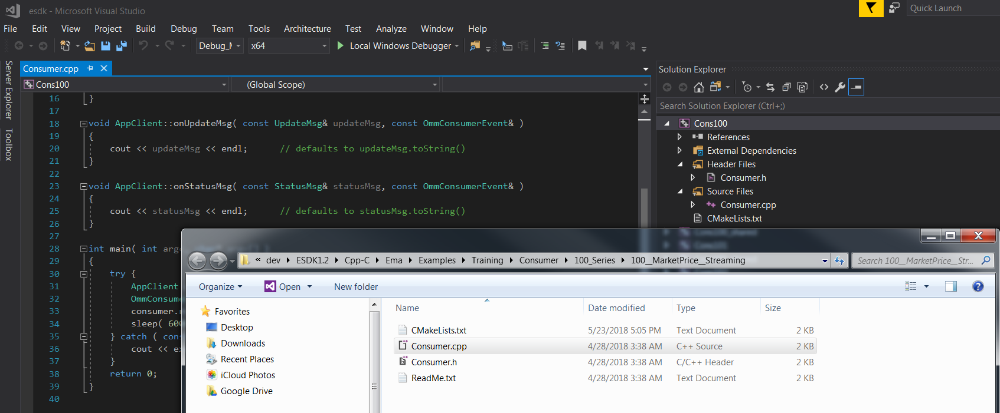
You can also access the project files for each Example directly, it locates under folder __VisualStudio2017__. 

__Usecase 2__ Generate only Visual Studio project for either EMA or ETA. 

You can use the following command to generate EMA Example and TestTools solution and project files with Debug build, issue command.

```
c:\dev\ESDK1.2>cmake -H. -BVisualStudio2017 -G "Visual Studio 15 2017 Win64" -DBUILD_EMA_UNIT_TESTS=OFF -DBUILD_ETA_APPLICATIONS=OFF -DBUILD_UNIT_TESTS=OFF -DBUILD_ETA_UNIT_TESTS=OFF -DCMAKE_BUILD_TYPE=Debug
```

* To generate ETA Example and TestTools solution and project files with Debug build, issue the following command
```
c:\dev\ESDK1.2>cmake -H. -BVisualStudio2017 -G "Visual Studio 15 2017 Win64" -DBUILD_EMA_UNIT_TESTS=OFF -DBUILD_ETA_APPLICATIONS=ON -DBUILD_UNIT_TESTS=OFF -DBUILD_ETA_UNIT_TESTS=OFF -DBUILD_EMA_EXAMPLES=OFF -DBUILD_EMA_PERFTOOLS=OFF -DBUILD_EMA_LIBRARY=OFF -DBUILD_EMA_TRAINING=OFF -DCMAKE_BUILD_TYPE=Debug
```

## Building with CMake on Linux
Thomson Reuters uses the default gnu compiler provided by CMake and included in the Linux distribution. For supported OS and compilers, refer to the [API Compatability Matrix](https://developers.thomsonreuters.com/content/api-compatibility-matrix-7).

__Step 1__

Obtains Elektron SDK 1.2 linux package from developer community and then unpack the package to directory of your choice. In this article we use Oracle Linux 7.5 and we unpack the package to __/home/user/dev/ESDK1.2__. We will use folder ESDK1.2 as __sourceDir__ when running CMake.

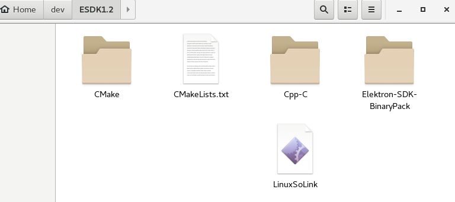

__Step 2__

Run the LinuxSoLink script: at a command prompt (e.g., in a terminal window) from the sourceDir directory, issue the
command:
```
./LinuxSoLink
```
__Step 3__

At a command prompt (e.g., in a terminal window), issue the command from the directory immediately above sourceDir:

```
cmake -HsourceDir -BbuildDir [-Doption ...]
```

Where:
• __sourceDir__ is the directory in which the top-level CMake entry point (CMakeLists.txt) resides. By default, when you
build using Makefile files, output is sent to directory specified in sourceDir.

• __buildDir__ is the CMake binary directory (for the CMake build tree).

• __option__ is a command line option and its associated value (e.g., __-DBUILD_EMA_UNIT_TESTS=OFF__). You can control
aspects of how CMake builds the ESDK by using command line options.

The cmake command builds all needed Makefile files (and related dependencies) in the CMake build tree in their associated directories (i.e., example executables are in the Executables directory and libraries (e.g., libema.lib, librssl.lib) in the Lib directory). You open these files and build all libraries and examples in the same fashion as you did with prior ESDKs.

You can just run CMake to generate build files using the same options as the use cases from previous topic.

For example,

You want to generate build files for EMA and ETA Training examples with TestTools and use Debug option. You can just use the following command line:
```
./cmake -H. -Bbuildfiles_debug -DBUILD_EMA_UNIT_TESTS=OFF -DBUILD_ETA_APPLICATIONS=ON -DBUILD_UNIT_TESTS=OFF -DBUILD_ETA_UNIT_TESTS=OFF -DCMAKE_BUILD_TYPE=Debug

```
It will show below output and generate all needed Makefiles under folder __ESDK1.2/buildfiles_debug__. You can just access the examples folder under __buildfiles_debug__ and run __make__ command to build individual project.
```
-DCMAKE_BUILD_TYPE=Debug
-- The C compiler identification is GNU 4.8.5
-- The CXX compiler identification is GNU 4.8.5
-- Check for working C compiler: /usr/bin/cc
-- Check for working C compiler: /usr/bin/cc -- works
-- Detecting C compiler ABI info
-- Detecting C compiler ABI info - done
-- Detecting C compile features
-- Detecting C compile features - done
-- Check for working CXX compiler: /usr/bin/c++
-- Check for working CXX compiler: /usr/bin/c++ -- works
-- Detecting CXX compiler ABI info
-- Detecting CXX compiler ABI info - done
-- Detecting CXX compile features
-- Detecting CXX compile features - done
-- incoming CMAKE_BUILD_TYPE is Debug
-- Found Elektron-SDK-BinaryPack: Elektron-SDK-BinaryPack::rsslVACache_static;Elektron-SDK-BinaryPack::rsslVACache_shared;Elektron-SDK-BinaryPack::ansiLib;Elektron-SDK-BinaryPack::dacsLib (Required is at least version "1.2.0.1") 
-- Found OpenSSL: /usr/lib64/libcrypto.so (found version "1.0.2k") 
-- Skipping Eta Unit Tests Build: BUILD_ETA_UNIT_TESTS:OFF
-- Skipping Eta Doxygen Build: BUILD_ETA_DOXYGEN:OFF
-- Skipping Ema Unit Tests Build: BUILD_EMA_UNIT_TESTS:OFF
-- Skipping Ema Doxygen Build: BUILD_EMA_DOXYGEN:OFF
-- Configuring done
-- Generating done
-- Build files have been written to: /home/user/dev/ESDK1.2/buildfiles_debug

```

## CMake GUI

Apart from using CMake command line, you can use the CMake GUI to generate and configure CMake project. This can be convenient if you don’t like the command line.

Basically Make stores a lot of configuration settings in the project’s cache. This [cache](https://cmake.org/runningcmake/) can be viewed and edited using the CMake GUI. It quite be easy tool to help you setup the project as the settings are presented in a nice list. You can also change build type to a new value such as "Debug" or "Optimized" or you can add specific compiler flag using the tool.

You can follow the following steps to generate build files using CMake GUI.

__Step 1__

Start CMake GUI

On Linux using the GUI on GNome or KDE desktop and Windows you can run the same command line.
```
cmake-gui
```
or start the following program on Windows 

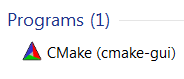

It will start the GUI like below screen shots.

Linux

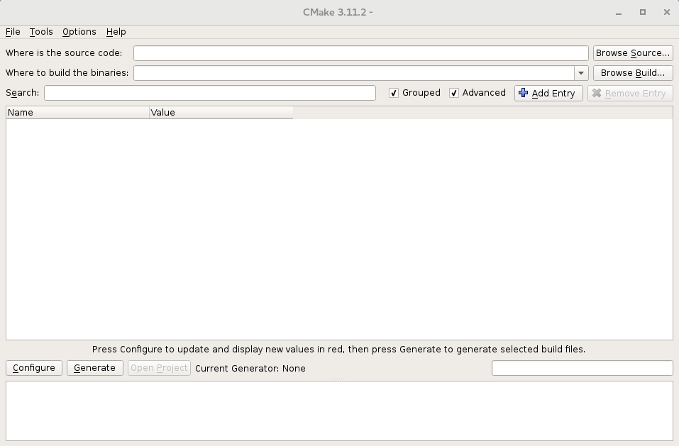

Windows

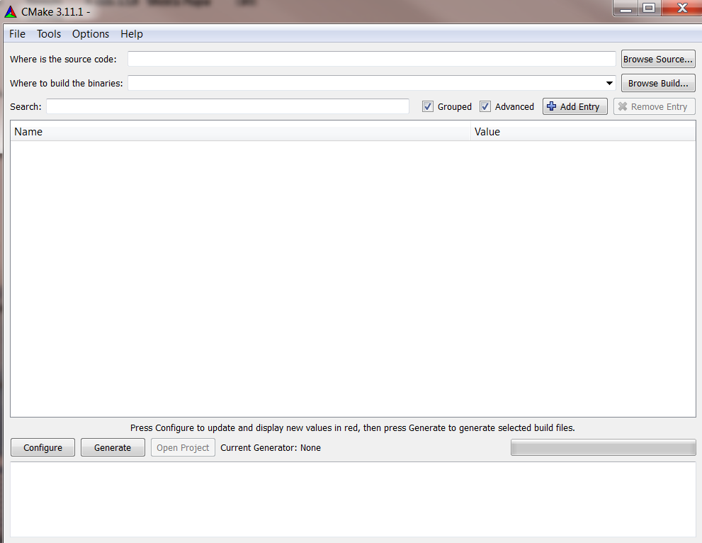

__Step 2__
Specify a path to source code which is the sourceDir(c:/dev/ESDK1.2) mentioned previous topic. We want to generate Visual Studio 2017 solution and project files under folder VisualStudio2017 therefore we set build path to (c:/dev/ESDK1.2/VisualStudio2017). 

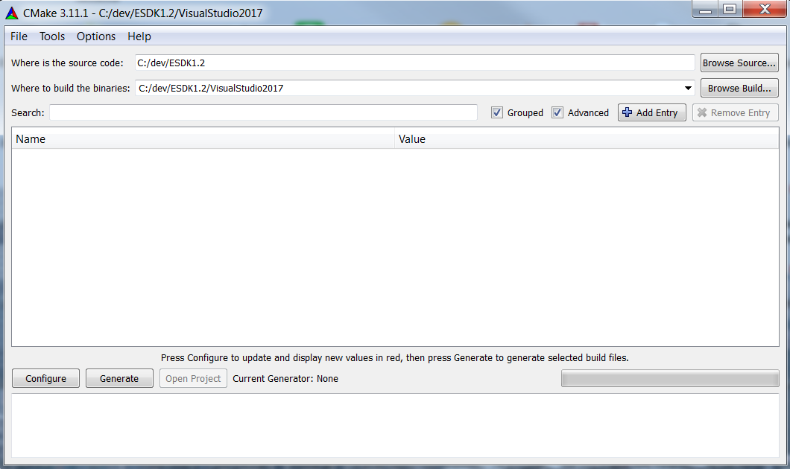

Then click Configure button, it will ask user to confirm if they want to create folder VisualStudio2017 under folder c:/dev/ESDK1.2/.

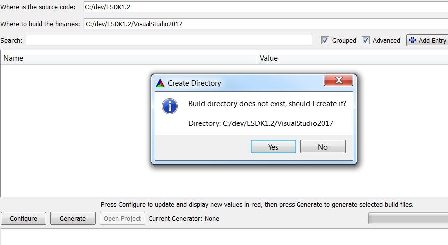

__Step 3__ 

Choosing Visual Studio generator, this step, the GUI will ask user to select the generator for this project. There is the same value as using cmake with -G from section __Building with CMake on Windows__.  But it's quite easy for the user to choose the generator from the list and it can avoid typo comparing with using command line.

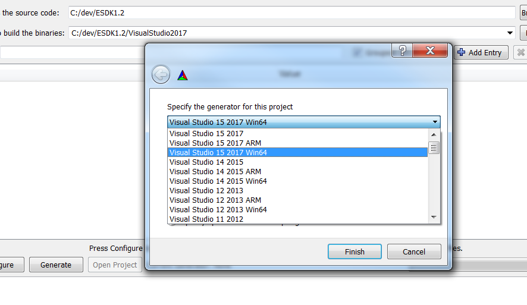

Then the GUI automatically call cmake command to generate build files with default options.
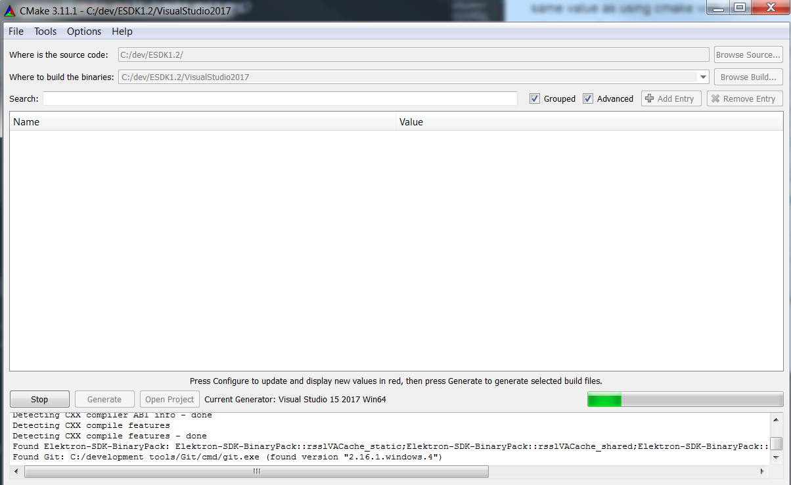

If you expand tab Build from the GUI, it will shows option that Cmake script currently use.

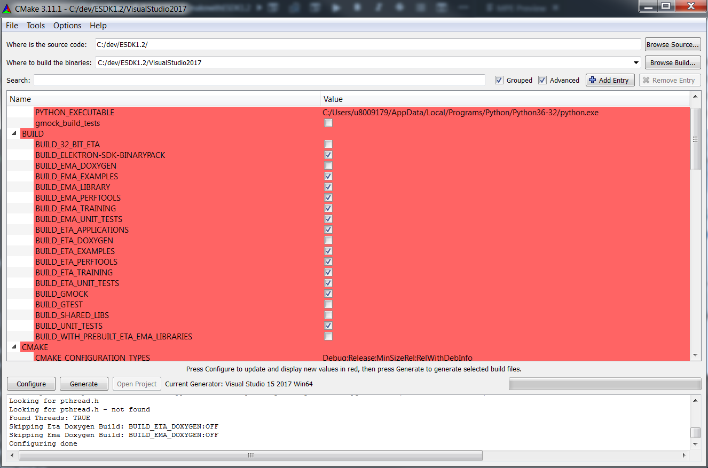

__Step 4__ 
Reconfigured the build options. At this steps, we can change the Build options as we needed and then click Generate button to regenerate the build files again. You can also change compile flag, build flag via the GUI tool.

Below sample is the options to generate both ETA and EMA examples and test tools like the __Usecase 1__ we talk earlier. We do not need UnitTests and Google Test so we remove it from Build list.

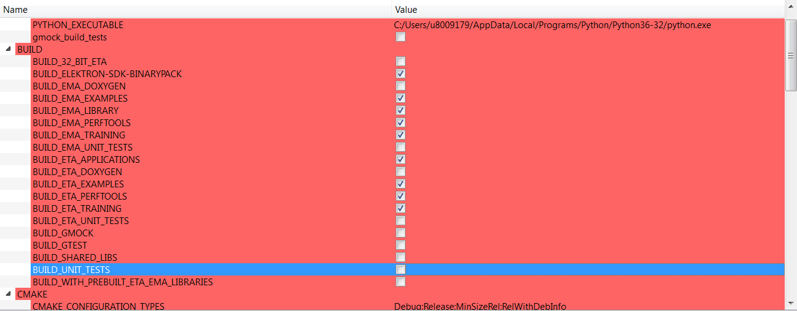

Open folder VisualStudio2017 you will see the esdk.sln and project files generate under this folder. It's the same as build files generated by cmake command line.

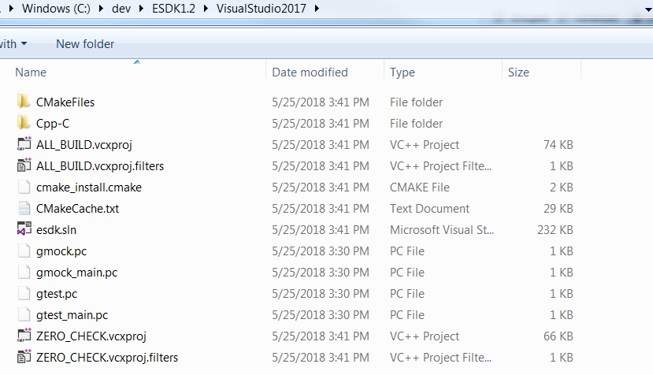

Regarding to cmak-gui on Linux, you can use the same steps as Windows and it should provide more flexible way to the developer who don't need to use command line to build Elektron SDK build files. Let see following example to demonstrate the usage of __cmake-gui_ on Oracle Linux 7.5.

We run __cmake_gui__ command on Oracle Linux and then set source code path to directory __/home/mcca/dev/ESDK1.2__ which is sourceDir and then set path for keep build files to __/home/mcca/dev/ESDK1.2/esdkbuildfiles__ which is the same folder as the path we use cmake command generate the build files previously. CMake GUI can read the configuration from the CMake cache and then display BUILD flags including other parameters used by CMake on the GUI like below screen shot.

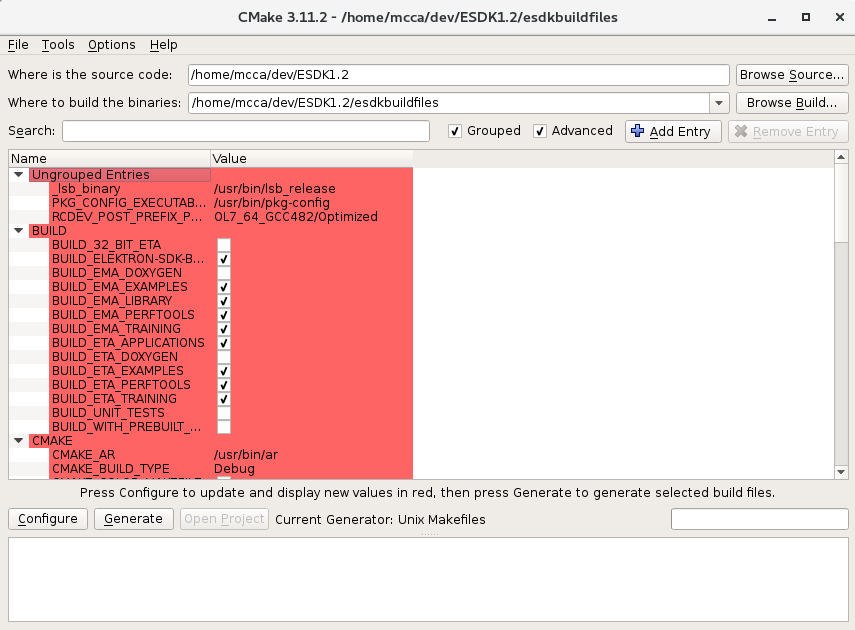 

Next step we can modify BUILD flags including other configuration from the GUI and then click Configuration button follow by the Generate button in order to re-generate build files under folder __esdkbuildfiles__. 

Below screenshot is resulted after removing BUILD_ETA_PERFTOOLS flag from Build list and then re-generate build files. You can find summary details from the text area under the Configure button.
 
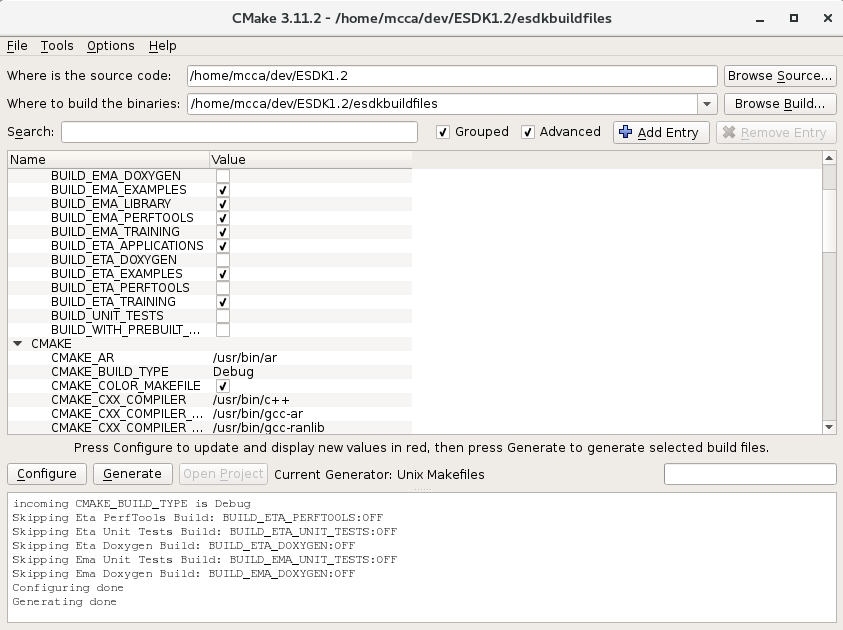

Note that you can just delete __esdkbuildfiles__ folder or change it to new path, in case of you want to re-configured the build files.

## Conclusions

There are big changes in ESDK 1.2 regarding folder structures and the way developer use to build EMA and ETA  examples and tools including the libraries. In the new version, developers must use CMake dynamically generate Visual Studio solution and project files on Windows and they have to use CMake to generate Linux build files as well. This article explain the steps to use CMake and CMake-GUI tools to generate the build files so that a new API user or developer who has no experience with CMake can continue their works on the new version.

## References

* [CMake Installation Guide](https://cmake.org/install/). 
* [Running CMake](https://cmake.org/runningcmake/).
* [EMA C/C++ Miagration Guide from Elektron SDK packages](https://developers.thomsonreuters.com/elektron/elektron-sdk-cc/downloads).
* [EMA and ETA C/C++ Release notes](https://developers.thomsonreuters.com/elektron/elektron-sdk-cc/docs)